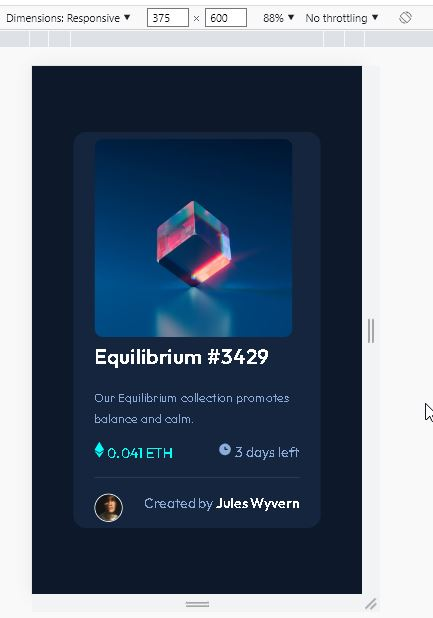
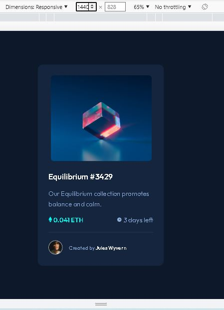

# Make It Real - NFT preview card component

This is a solution to the HTML 6 NFT preview card component project of the Make It Real course.

## Table of contents

  - [Overview](#overview)
  - [The challenge](#the-challenge)
  - [Screenshot](#screenshot)
  - [My process](#my-process)
  - [Built with](#built-with)
  - [What I learned](#what-i-learned)
  - [Continued development](#continued-development)
  - [Useful resources](#useful-resources)
  - [Author](#author)
  - [Acknowledgments](#acknowledgments)

## Overview

### The challenge

Su desafío es construir este componente de tarjeta de vista previa y lograr que se parezca lo más posible al diseño.

Puedes usar cualquier herramienta que te guste para ayudarte a completar el desafío. Entonces, si tienes algo que te gustaría practicar, no dudes en intentarlo.

Tus usuarios deberían poder:

Ver el diseño óptimo según el tamaño de pantalla de su dispositivo
Ver hover y focus para elementos interactivos

### Screenshot

Se insertan los screenshot de las vistas

## My process

### Built with

- Semantic HTML5 markup
- CSS custom properties
- Flexbox
- Mobile-first workflow

### What I learned

Se aplica el manejo de layout "absolute and relative" para la imagen principal.

### Continued development

Se debe reforzar el uso de Hover.

### Useful resources

- [Example resource 1](https://www.example.com) - This helped me for XYZ reason. I really liked this pattern and will use it going forward.
- [Example resource 2](https://www.example.com) - This is an amazing article which helped me finally understand XYZ. I'd recommend it to anyone still learning this concept.

## Author

- [Nicolas Rodriguez and Oscar Nuñez]

## Acknowledgments

This is where you can give a hat tip to anyone who helped you out on this project. Perhaps you worked in a team or got some inspiration from someone else's solution. This is the perfect place to give them some credit.
